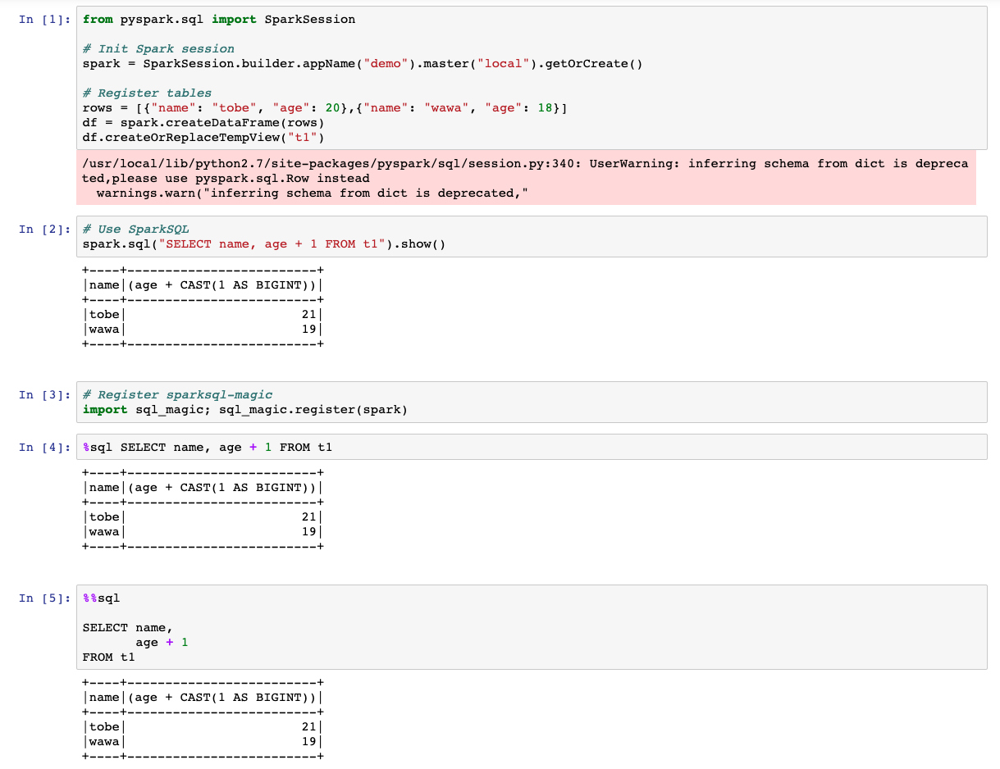

# SparkSQL Magic

## Introduction

It is the notebook magic function to run SQL directly with SparkSQL.



## Usage

Initialize Spark session and register.

```
import sql_magic; sql_magic.register(spark)
```

Use the line magic function.

```
%sql SELECT name, age + 1 FROM t1
```

Use the cell magic funcition.

```
%%sql 

SELECT name, 
       age + 1
FROM t1
```
